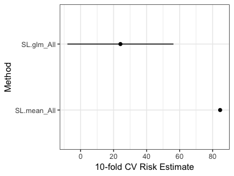
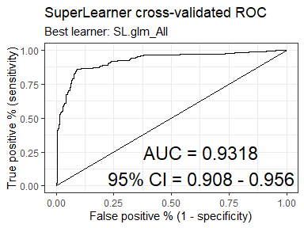
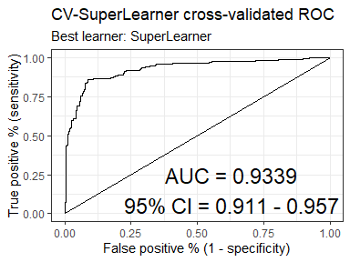

<!-- README.md is generated from README.Rmd. Please edit that file -->

# ck37r

[](https://travis-ci.org/ck37/ck37r)
[](https://ci.appveyor.com/project/ck37/ck37r/history)
[](https://codecov.io/gh/ck37/ck37r)
[](https://cran.r-project.org/package=ck37r)

My R toolkit for organizing analysis projects, cleaning data for machine
learning, parallelizing code for multiple cores or in a SLURM cluster,
and extended functionality for
[SuperLearner](http://github.com/ecpolley/SuperLearner) and
[TMLE](github.com/cran/tmle). Some of the SuperLearner functions may
eventually be migrated into the SuperLearner package.

## Installation

Install the [latest release from
CRAN](https://cran.r-project.org/package=ck37r):

``` r
install.packages("ck37r") 
```

Install the development version from github (recommended):

``` r
# install.packages("remotes")
remotes::install_github("ck37/ck37r")
```

## Functions

  - **Project Utilities**
      - `import_csvs` - import all CSV files in a given directory.
      - `load_all_code` - source() all R files in a given directory.
      - `load_packages` - load a list of packages; for the ones that
        fail it can attempt to install them automatically from CRAN,
        then load them again.
  - **Machine Learning**
      - `categoricals_to_factors` - convert numeric categoricals into
        factors.
      - `factors_to_indicators` - convert all factors in a dataframe to
        series of indicators (one-hot encoding).
      - `impute_missing_values` - impute missing values in a dataframe
        (median for numerics and mode for factors; or k-nearest
        neighbors), add missingness indicators.
      - `missingness_indicators` - return a matrix of missingness
        indicators for a dataframe, (optionally) omitting any constant
        or collinear columns.
      - `rf_count_terminal_nodes` - count the number of terminal nodes
        in each tree in a random forest. That information can then be
        used to grid-search the maximum number of nodes allowed in a
        Random Forest (along with mtry).
      - `standardize` - standardize a dataset (center, scale),
        optionally omitting certain variables.
      - `vim_corr` - rudimentary variable importance based on
        correlation with an outcome.
  - **Parallelization**
      - `parallelize` - starts a multicore or multinode parallel
        cluster. Automatically detects parallel nodes in a SLURM
        environment, which makes code work seemlessly on a laptop or a
        cluster.
      - `stop_cluster` - stops a cluster started by `parallelize()`.
  - **SuperLearner**
      - `auc_table` - table of cross-validated AUCs for each learner in
        an ensemble, including SE, CI, and p-value. Supports
        SuperLearner and CV.SuperLearner objects.
      - `gen_superlearner` - create a SuperLearner and CV.SuperLearner
        function setup to transparently use a certain parallelization
        configuration.
      - `cvsl_weights` - table of the meta-weight distribution for each
        learner in a CV.SuperLearner analysis.
      - `cvsl_auc` - cross-validated AUC for a CV.SuperLearner analysis.
      - `plot_roc` - ROC plot with AUC and CI for a SuperLearner or
        CV.SuperLearner object.
      - `plot.SuperLearner` - plot risk estimates and CIs for a
        SuperLearner, similar to CV.Superlearner except without SL or
        Discrete SL.
      - `sl_stderr` - calculate standard error for each learner’s risk
        in SL.
      - `SL.h2o_auto()` - wrapper for h2o’s automatic machine learning
        system, to be added to SuperLearner.
      - `SL.bartMachine2()` - wrapper for bartMachine, to be added to
        SuperLearner.
  - **TMLE**
      - `tmle_parallel` - allows the SuperLearner estimation in TMLE to
        be customized, esp. to support parallel estimation via
        mcSuperLearner and snowSuperLearner.
      - `setup_parallel_tmle` - helper function to start a cluster and
        setup SuperLearner and tmle\_parallel to use the created
        cluster.
  - **h2o**
      - `h2o_init_multinode()` - function to start an h2o cluster on
        multiple nodes from within R, intended for use on SLURM or other
        multi-node clusters.
  - **Misc**
      - `set_java_memory()` - set rJava’s maximum memory usage.
      - `get_java_memory()` - get rJava’s maximum allocated memory.

## Examples

### Impute missing values

``` r
# Load a test dataset.
# TODO: need to switch to a different dataset.
data(PimaIndiansDiabetes2, package = "mlbench")

# Check for missing values.
colSums(is.na(PimaIndiansDiabetes2))
#> pregnant  glucose pressure  triceps  insulin     mass pedigree      age 
#>        0        5       35      227      374       11        0        0 
#> diabetes 
#>        0

# Impute missing data and add missingness indicators.
# Don't impute the outcome though.
result = impute_missing_values(PimaIndiansDiabetes2, skip_vars = "diabetes")

# Confirm we have no missing data.
colSums(is.na(result$data))
#>      pregnant       glucose      pressure       triceps       insulin 
#>             0             0             0             0             0 
#>          mass      pedigree           age      diabetes  miss_glucose 
#>             0             0             0             0             0 
#> miss_pressure  miss_triceps  miss_insulin     miss_mass 
#>             0             0             0             0

#############
# K-nearest neighbors imputation
# NOTE: this will  also center and scale the covariates, which you may or may not want.
result2 = impute_missing_values(PimaIndiansDiabetes2, type = "knn", skip_vars = "diabetes")

# Confirm we have no missing data.
colSums(is.na(result2$data))
#>      pregnant       glucose      pressure       triceps       insulin 
#>             0             0             0             0             0 
#>          mass      pedigree           age      diabetes  miss_glucose 
#>             0             0             0             0             0 
#> miss_pressure  miss_triceps  miss_insulin     miss_mass 
#>             0             0             0             0
```

### Load packages

This loads a vector of packages, automatically installing any packages
that aren’t already installed.

``` r
# Load these 4 packages and install them if necessary.
load_packages(c("MASS", "SuperLearner", "tmle", "doParallel"), auto_install = TRUE)
#> Super Learner
#> Version: 2.0-25-9000
#> Package created on 2018-07-10
#> Welcome to the tmle package, version 1.3.0-2
#> 
#> Use tmleNews() to see details on changes and bug fixes
```

### Random Forest: count terminal nodes

We estimate one standard Random Forest first and examine how many
terminal nodes are in each decision tree. We take the maximum of that as
the most data-adaptive Random Forest in terms of decision tree size,
then compare to Random Forests in which they are restricted to have
smaller decision trees. This allows the SuperLearner to explore under
vs. over-fitting for a Random Forest. See Segal (2004) and Segal & Xiao
(2011) for details on overfitting in Random Forests.

``` r
library(SuperLearner)
library(ck37r)

data(Boston, package = "MASS")

set.seed(1)
(sl = SuperLearner(Boston$medv, subset(Boston, select = -medv), family = gaussian(),
                  cvControl = list(V = 3L),
                  SL.library = c("SL.mean", "SL.glmnet", "SL.randomForest")))
#> Loading required package: glmnet
#> Loading required package: Matrix
#> Loaded glmnet 2.0-16
#> Loading required package: randomForest
#> randomForest 4.6-14
#> Type rfNews() to see new features/changes/bug fixes.
#> 
#> Call:  
#> SuperLearner(Y = Boston$medv, X = subset(Boston, select = -medv), family = gaussian(),  
#>     SL.library = c("SL.mean", "SL.glmnet", "SL.randomForest"), cvControl = list(V = 3L)) 
#> 
#> 
#> 
#>                         Risk Coef
#> SL.mean_All         84.81661    0
#> SL.glmnet_All       25.05513    0
#> SL.randomForest_All 12.35285    1

summary(rf_count_terminal_nodes(sl$fitLibrary$SL.randomForest_All$object))
#>    Min. 1st Qu.  Median    Mean 3rd Qu.    Max. 
#>   142.0   163.0   167.0   166.5   170.0   186.0

(max_terminal_nodes = max(rf_count_terminal_nodes(sl$fitLibrary$SL.randomForest_All$object)))
#> [1] 186

# Now run create.Learner() based on that maximum.

# It is often handy to convert to log scale of a hyperparameter before testing a ~linear grid.
# NOTE: -0.7 ~ log(0.5) which is the multiplier that yields sqrt(max)
(maxnode_seq = unique(round(exp(log(max_terminal_nodes) * exp(c(-0.6, -0.35, -0.15, 0))))))
#> [1]  18  40  90 186

rf = create.Learner("SL.randomForest", detailed_names = TRUE,
                    name_prefix = "rf",
                    params = list(ntree = 100L), # fewer trees for testing speed only.
                    tune = list(maxnodes = maxnode_seq))

# We see that an RF with simpler decision trees performs better than the default.
(sl = SuperLearner(Boston$medv, subset(Boston, select = -medv), family = gaussian(),
                  cvControl = list(V = 3L),
                  SL.library = c("SL.mean", "SL.glmnet", rf$names)))
#> 
#> Call:  
#> SuperLearner(Y = Boston$medv, X = subset(Boston, select = -medv), family = gaussian(),  
#>     SL.library = c("SL.mean", "SL.glmnet", rf$names), cvControl = list(V = 3L)) 
#> 
#> 
#> 
#>                   Risk      Coef
#> SL.mean_All   84.60985 0.0000000
#> SL.glmnet_All 25.16622 0.0000000
#> rf_18_All     16.29784 0.0000000
#> rf_40_All     14.04267 0.0000000
#> rf_90_All     13.17502 0.7733663
#> rf_186_All    13.40373 0.2266337
```

### Parallel TMLE

``` r
library(ck37r)
library(tmle)

# Use multiple cores as available.
ck37r::setup_parallel_tmle()

# Basic SL library.
sl_lib = c("SL.mean", "SL.rpart", "SL.glmnet")

# Set a parallel-compatible seed so cross-validation folds are deterministic.
set.seed(1, "L'Ecuyer-CMRG")
# Just an example -- we haven't defined A or W in this code.
result = run_tmle(Y = Y, A = A, W = W, family = "binomial",
                  g.SL.library = sl_lib, Q.SL.library = sl_lib)
```

### SuperLearner AUC Table

This will return an AUC table for all learners. It does not include
Discrete SL or SuperLearner as those require CV.SuperLearner.

``` r
library(SuperLearner)
library(ck37r)

data(Boston, package = "MASS")

set.seed(1)
sl = SuperLearner(Y = as.numeric(Boston$medv > 23),
                  X = subset(Boston, select = -medv),
                  family = binomial(),
                  SL.library = c("SL.mean", "SL.glm"))

auc_table(sl, y = Boston$chas)
#>       learner       auc         se  ci_lower  ci_upper    p-value
#> 1 SL.mean_All 0.5000000 0.08758016 0.3283460 0.6716540 0.06419997
#> 2  SL.glm_All 0.6331605 0.03526965 0.5640333 0.7022878 0.50000000
```

### SuperLearner plot of risk estimates

This is similar to CV.SuperLearner’s plot except SuperLearner cannot
estimate risk for the Discrete SL and SuperLearner, so those must be
omitted here.

``` r
library(SuperLearner)
library(ck37r)

data(Boston, package = "MASS")

set.seed(1)
sl = SuperLearner(Boston$medv, subset(Boston, select = -medv),
                  family = gaussian(),
                  SL.library = c("SL.mean", "SL.glm"))

sl
#> 
#> Call:  
#> SuperLearner(Y = Boston$medv, X = subset(Boston, select = -medv), family = gaussian(),  
#>     SL.library = c("SL.mean", "SL.glm")) 
#> 
#> 
#>                 Risk       Coef
#> SL.mean_All 84.56082 0.01915589
#> SL.glm_All  24.13176 0.98084411
plot(sl, y = Boston$chas)
```

<!-- -->

### SuperLearner ROC plot

``` r
library(SuperLearner)
library(ck37r)

data(Boston, package = "MASS")

set.seed(1)
(sl = SuperLearner(Y = as.numeric(Boston$medv > 23),
                  X = subset(Boston, select = -medv),
                  family = binomial(),
                  SL.library = c("SL.mean", "SL.glm")))
#> 
#> Call:  
#> SuperLearner(Y = as.numeric(Boston$medv > 23), X = subset(Boston, select = -medv),  
#>     family = binomial(), SL.library = c("SL.mean", "SL.glm")) 
#> 
#> 
#>                   Risk       Coef
#> SL.mean_All 0.23511955 0.01260907
#> SL.glm_All  0.09470232 0.98739093

plot_roc(sl, y = Boston$chas)
```

<!-- -->

### CV.SuperLearner AUC

This will return the AUC inference for the CV.SuperLearner.

``` r
library(SuperLearner)
library(ck37r)

data(Boston, package = "MASS")

set.seed(1)
cvsl = CV.SuperLearner(Y = as.numeric(Boston$medv > 23),
                       X = subset(Boston, select = -medv),
                       family = binomial(),
                       cvControl = list(V = 2, stratifyCV = T),
                       SL.library = c("SL.mean", "SL.glmnet"))
cvsl_auc(cvsl)
#> $cvAUC
#> [1] 0.9258827
#> 
#> $se
#> [1] 0.01280423
#> 
#> $ci
#> [1] 0.9007869 0.9509786
#> 
#> $confidence
#> [1] 0.95
```

### CV.SuperLearner AUC table

This will return an AUC table for all learners, plus DiscreteSL and the
SuperLearner.

``` r
library(SuperLearner)
library(ck37r)

data(Boston, package = "MASS")

set.seed(1)
y = as.numeric(Boston$medv > 23)
cvsl = CV.SuperLearner(Y = y,
                       X = subset(Boston, select = -medv),
                       family = binomial(),
                       cvControl = list(V = 2, stratifyCV = TRUE),
                       SL.library = c("SL.mean", "SL.glmnet"))
auc_table(cvsl, y = y)
#>                     auc         se  ci_lower  ci_upper      p-value
#> SL.mean_All   0.5000000 0.04590129 0.4100351 0.5899649 8.615879e-21
#> SL.glmnet_All 0.9258827 0.01280423 0.9007869 0.9509786 5.000000e-01
#> DiscreteSL    0.9258827 0.01280423 0.9007869 0.9509786 5.000000e-01
#> SuperLearner  0.9258827 0.01280423 0.9007869 0.9509786 5.000000e-01
```

### CV.SuperLearner plot ROC

``` r
library(SuperLearner)
library(ck37r)

data(Boston, package = "MASS")

set.seed(1)
y = as.numeric(Boston$medv > 23)
cvsl = CV.SuperLearner(Y = y,
                       X = subset(Boston, select = -medv),
                       family = binomial(),
                       cvControl = list(V = 2, stratifyCV = T),
                       SL.library = c("SL.mean", "SL.glmnet"))
plot_roc(cvsl, y = y)
```

<!-- -->

### CV.SuperLearner weight table

Returns summary statistics (mean, sd, min, max) on the distribution of
the weights assigned to each learner across SuperLearner ensembles. This
makes it easier to understand the stochastic nature of the SL learner
weights and to see how often certain learners are used.

``` r
library(SuperLearner)
library(ck37r)

data(Boston, package = "MASS")

set.seed(1)
cvsl = CV.SuperLearner(Y = as.numeric(Boston$medv > 23),
                       X = subset(Boston, select = -medv),
                       family = binomial(),
                       cvControl = list(V = 2, stratifyCV = T),
                       SL.library = c("SL.mean", "SL.glmnet"))
cvsl_weights(cvsl)
#>   # Learner Mean SD Min Max
#> 1 1  glmnet    1  0   1   1
#> 2 2    mean    0  0   0   0
```

More examples to be added.

## References

Breiman, L. (2001). Random forests. Machine learning, 45(1), 5-32.

Dudoit, S., & van der Laan, M. J. (2005). Asymptotics of cross-validated
risk estimation in estimator selection and performance assessment.
Statistical Methodology, 2(2), 131-154.

LeDell, E., Petersen, M., & van der Laan, M. (2015). Computationally
efficient confidence intervals for cross-validated area under the ROC
curve estimates. Electronic journal of statistics, 9(1), 1583.

Polley EC, van der Laan MJ (2010) Super Learner in Prediction. U.C.
Berkeley Division of Biostatistics Working Paper Series. Paper 226.
<http://biostats.bepress.com/ucbbiostat/paper266/>

Segal, M. R. (2004). Machine learning benchmarks and random forest
regression.

Segal, M., & Xiao, Y. (2011). Multivariate random forests. Wiley
Interdisciplinary Reviews: Data Mining and Knowledge Discovery, 1(1),
80-87.

Sing, T., Sander, O., Beerenwinkel, N., & Lengauer, T. (2005). ROCR:
visualizing classifier performance in R. Bioinformatics, 21(20),
3940-3941.

van der Laan, M. J., Polley, E. C. and Hubbard, A. E. (2007) Super
Learner. Statistical Applications of Genetics and Molecular Biology, 6,
article 25.
<http://www.degruyter.com/view/j/sagmb.2007.6.issue-1/sagmb.2007.6.1.1309/sagmb.2007.6.1.1309.xml>

van der Laan, M. J., & Rose, S. (2011). Targeted learning: causal
inference for observational and experimental data. Springer Science &
Business Media.

van der Laan, M. J., & Rubin, D. (2006). Targeted Maximum Likelihood
Learning. The International Journal of Biostatistics, 2(1), 1-38.
